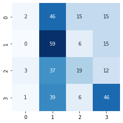
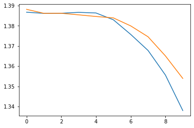

```python
import os 
import random
import numpy as np
import seaborn as sns

import tensorflow as tf
from tensorflow import keras
# import tensorflow_addons as tfa
from tensorflow.keras.preprocessing.image import ImageDataGenerator, load_img
# from tensorflow_addons.metrics import F1Score
import matplotlib.pyplot as plt
import cv2
import skimage
from tensorflow.keras import layers
from keras.layers import Dense, Dropout, Activation, Flatten, BatchNormalization
from keras.applications import VGG16
import tensorflow.keras.applications as app
from sklearn.metrics import confusion_matrix
```


```python
imageSize=150
train_dir = "OCT2017/OCT2017/train/"
test_dir =  "OCT2017/OCT2017/test/"
# ['DME', 'CNV', 'NORMAL', '.DS_Store', 'DRUSEN']
from tqdm import tqdm
X = []
y = []

# there are four classes to be predicted
predictions = ['NORMAL', 'CNV', 'DME', 'DRUSEN']
for i in range(0,4):
    # a counter is used to limit the number of images added to the training and testing dataset
    counter = 0;
    # iterating through the four directories and reading in images with the CV2 package
    for image in tqdm(os.listdir(train_dir + predictions[i])):
        img_file = cv2.imread(train_dir + predictions[i] + '/' + image)
        # only accepting valid images
        if img_file is not None:
            # resizing all image inputs to be at a standard (150, 150, 3) size
            img_file = skimage.transform.resize(img_file, (imageSize, imageSize, 3))
            img_arr = np.asarray(img_file)
            # adding image to the X matrix
            X.append(img_arr)
            # adding the index as the y target (0: normal, 1: cnv, 2: dme, 3: drusen)
            y.append(i)
        counter+=1
        if counter > 400:
            break

# converting to a numpy array
X_test = np.asarray(X)
y_test = np.asarray(y)


# split data into training and testing from the training directory 
# this design decision was made to minimize the amount of time needed to build a model
from sklearn.model_selection import train_test_split
X_train, X_test, y_train, y_test = train_test_split(X_test, y_test, test_size=0.2)
```

      2%|▏         | 400/26315 [00:46<50:09,  8.61it/s]  
      1%|          | 400/37205 [00:48<1:14:49,  8.20it/s]
      4%|▎         | 400/11348 [00:36<16:26, 11.10it/s]
      5%|▍         | 400/8616 [00:42<14:37,  9.36it/s]
    


```python
# Scale images to the [0, 1] range
x_train = X_train.astype("float32") / 255
x_test = X_test.astype("float32") / 255

# Make sure images have shape (150, 150, 3)
print("x_train shape:", X_train.shape)
print(x_train.shape[0], "train samples")
print(x_test.shape[0], "test samples")

# convert class vectors to a hot vector: 0, 0, 0, 1 (like a binary output)
y_train = keras.utils.to_categorical(y_train, 4)
y_test = keras.utils.to_categorical(y_test, 4)
```

    x_train shape: (1283, 150, 150, 3)
    1283 train samples
    321 test samples
    


```python
# creating a sequential CNN using keras with maxpooling layers and dropout

model = keras.Sequential(
    [
        keras.Input(shape=(150, 150, 3)),
        layers.Conv2D(32, kernel_size=(3, 3), activation="relu"),
        layers.MaxPooling2D(pool_size=(2, 2)),
        layers.Conv2D(32, kernel_size=(3, 3), activation="relu"),
        layers.MaxPooling2D(pool_size=(2, 2)),
        layers.Flatten(),
        layers.Dropout(0.5),
        layers.Dense(4, activation="softmax"),
    ]
)

model.summary()
```

    Model: "sequential_3"
    _________________________________________________________________
    Layer (type)                 Output Shape              Param #   
    =================================================================
    conv2d_7 (Conv2D)            (None, 148, 148, 32)      896       
    _________________________________________________________________
    max_pooling2d_7 (MaxPooling2 (None, 74, 74, 32)        0         
    _________________________________________________________________
    conv2d_8 (Conv2D)            (None, 72, 72, 32)        9248      
    _________________________________________________________________
    max_pooling2d_8 (MaxPooling2 (None, 36, 36, 32)        0         
    _________________________________________________________________
    flatten_3 (Flatten)          (None, 41472)             0         
    _________________________________________________________________
    dropout_8 (Dropout)          (None, 41472)             0         
    _________________________________________________________________
    dense_3 (Dense)              (None, 4)                 165892    
    =================================================================
    Total params: 176,036
    Trainable params: 176,036
    Non-trainable params: 0
    _________________________________________________________________
    


```python
# adding a list of metrics for the fit method to show
metrics_list = ['accuracy']
# compiling model with an optimizer and loss function
model.compile(loss = 'categorical_crossentropy', optimizer = 'adam', metrics = metrics_list)
    # alternative: sparse_categorical_crossentropy

# fitting model to training set and using the testing set for validation
# TODO: change validation data to run on separate data
training = model.fit(x_train, y_train, batch_size=100, epochs=10, verbose=1, validation_split=0.1)
```

    Train on 1154 samples, validate on 129 samples
    Epoch 1/10
    1154/1154 [==============================] - 21s 18ms/sample - loss: 1.3882 - acc: 0.2539 - val_loss: 1.3868 - val_acc: 0.2016
    Epoch 2/10
    1154/1154 [==============================] - 20s 18ms/sample - loss: 1.3862 - acc: 0.2548 - val_loss: 1.3862 - val_acc: 0.2636
    Epoch 3/10
    1154/1154 [==============================] - 20s 17ms/sample - loss: 1.3862 - acc: 0.2556 - val_loss: 1.3862 - val_acc: 0.3488
    Epoch 4/10
    1154/1154 [==============================] - 20s 17ms/sample - loss: 1.3855 - acc: 0.3146 - val_loss: 1.3867 - val_acc: 0.2016
    Epoch 5/10
    1154/1154 [==============================] - 20s 17ms/sample - loss: 1.3846 - acc: 0.2652 - val_loss: 1.3864 - val_acc: 0.2016
    Epoch 6/10
    1154/1154 [==============================] - 20s 17ms/sample - loss: 1.3839 - acc: 0.2626 - val_loss: 1.3830 - val_acc: 0.2016
    Epoch 7/10
    1154/1154 [==============================] - 20s 17ms/sample - loss: 1.3800 - acc: 0.2938 - val_loss: 1.3757 - val_acc: 0.4729
    Epoch 8/10
    1154/1154 [==============================] - 20s 18ms/sample - loss: 1.3746 - acc: 0.3744 - val_loss: 1.3678 - val_acc: 0.3953
    Epoch 9/10
    1154/1154 [==============================] - 20s 17ms/sample - loss: 1.3651 - acc: 0.3873 - val_loss: 1.3556 - val_acc: 0.3876
    Epoch 10/10
    1154/1154 [==============================] - 20s 18ms/sample - loss: 1.3539 - acc: 0.3657 - val_loss: 1.3380 - val_acc: 0.4341
    


```python
# evaluating the model on unseen testing data
score = model.evaluate(x_test, y_test, verbose=1)
# printing the loss and the accuracy of the model
print("Test loss:", score[0])
print("Test accuracy:", score[1])
```

    321/321 [==============================] - 2s 5ms/sample - loss: 1.3518 - acc: 0.3925
    Test loss: 1.3517967265714366
    Test accuracy: 0.39252338
    


```python
# visualizing the confusion matrix of the model
y_pred = model.predict(x_test)
y_pred_c = np.argmax(y_pred, axis=1)
y_test_c = np.argmax(y_test, axis=1)
matrix_confusion = confusion_matrix(y_test_c, y_pred_c)

sns.heatmap(matrix_confusion, square=True, annot=True, cmap='Blues', fmt='d', cbar=False )
plt.show()
```


    

    


```python
# visualizing the model loss over 10 epochs
x = list(range(10))
vy = training.history['val_loss']
ty = training.history['loss']

plt.plot( x, vy )
plt.plot( x, ty )
plt.show()
```


    

    

